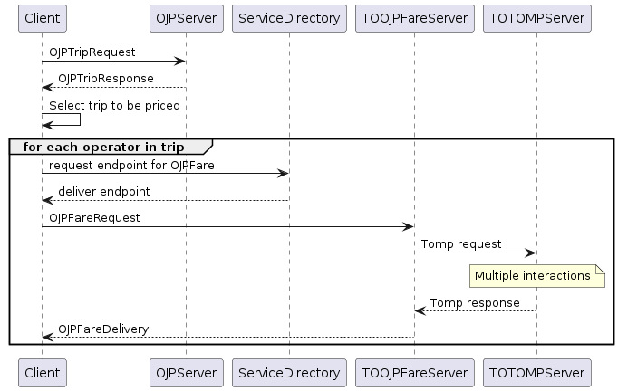
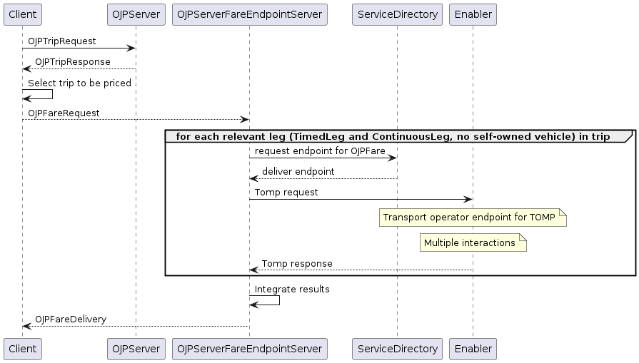

#Mapping OJP2TOMP

Following document describes the mapping from OJP to TOMP.

OJP does not support bookings, it can though be used to get pricing and availability information. This is handled within the planning phase in TOMP, more documentation on it can be found on their GitHub: [https://github.com/TOMP-WG/TOMP-API/wiki/Planning](https://github.com/TOMP-WG/TOMP-API/wiki/Planning)

Use Cases
---------

### Use Case 1: Calculate the price of a trip

1.  trip calculation with OJPTripRequest
2.  fare calculation for each TimedLeg and each ContinousLeg that is not an own vehicle mode 
    1.  from the Operator in the leg obtain the OJPFare service endpoint in the service directory 
    2.  if it does not exist, then don't price the leg and go to the next leg
    3.  create the relevant TOMP request(s) and process those
    4.  Update the pricing information in leg and trip.

  

Error handling:

*   Operator has no service end point in service directory: don't calculate that part of the price
*   Trip might be impossible due to changes within TOMP service (taxi not available, changes in drop-off point)

  
  
  
  

Mapping
-------

You can find the OJP to TOMP mappings under following links:

*   [Mapping for OJPFareRequest to TOMP "planning/inquiries" and "planning/offers" request](OJPFares_Mapping.md)

General Findings
----------------

*   According to the TOMP documentation "planning/inquiry" is used to check the availability of a trip and "planning/offer" is used to return a bookable offer. The request and response bodies of these endpoints are exactly the same, the only difference being the [booking\_id delivered by the "planning/offers" response](https://github.com/TOMP-WG/TOMP-API/wiki/Planning#just-before-giving-options-to-the-end-user). 
*   The request structure in TOMP has information about the trip as well as the requirements of the trip. In OJP, the OJPFares request has information on the trip and the OJPAvailability request on the requirements of a trip. To use the TOMP API the best solution would be to combine both OJP Fare and OJP Availability request.